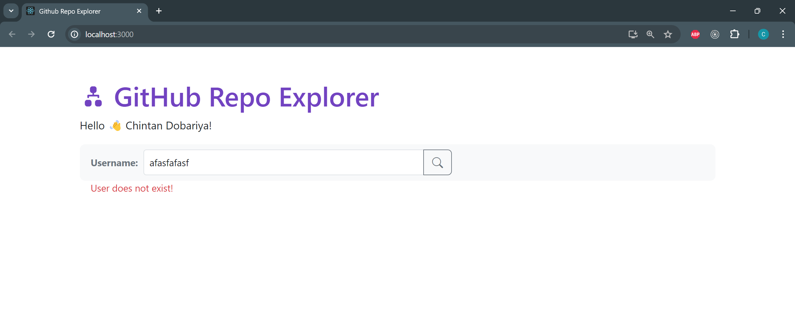
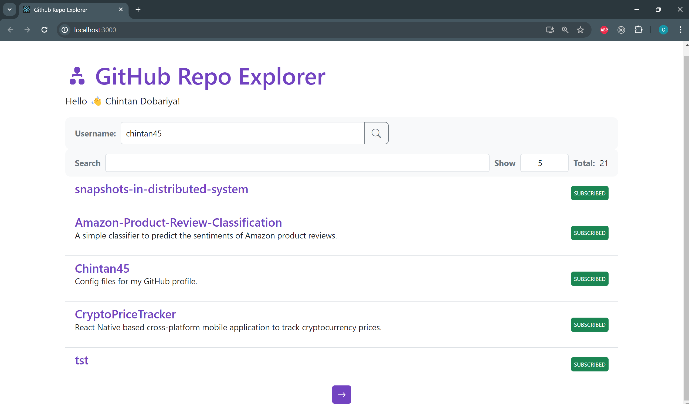

# GitHub Repository Explorer

### Overview

This project is a React application that utilizes GitHub's GraphQL API to search for repositories of a specific GitHub user. It allows users to enter a GitHub username, checks if the user exists, and then retrieves, displays and allows to explore a list of repositories belonging to that user.


### Installation

1. **Clone the repository:**
    ```
    git clone https://github.com/yourusername/github-user-repo-search.git
    cd github-user-repo-search
    ```

2. **Install dependencies:**
    ```
    npm install
    ```

3. **Set up environment variables:**
    Create a .env file in the root directory and copy the contents of .env-copy into it.
    ```
    cp .env-copy .env
    ```
    Replace replace_github_auth_token with your GitHub personal access token.
    ```
    REACT_APP_BASE_URL="https://api.github.com/graphql"
    REACT_APP_AUTH_TOKEN="bearer <replace_your_github_auth_token>"
    ```

4. **Start the development server:**
    ```
    npm start
    ```

### Screenshots
<div style="text-align:center;">
    
</div>
<div style="text-align:center;">
    
</div>

### Usage
1. Enter a GitHub Username:
    - In the input field provided by UserSearchBox, enter a GitHub username and click the search button.
    - The application will check if the user exists and display an error message if not.

2. View Repositories:
    - If the user exists, a list of repositories will be displayed.
    - Use the search box provided by QuerySearchBox to filter repositories by a query string and adjust the number of repositories per page.
    - Navigate through the pages using the NavButtons.